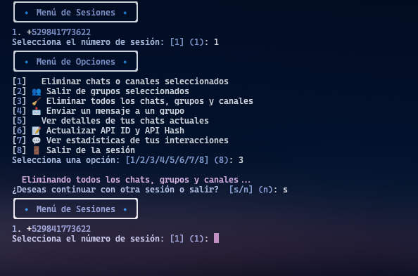

### 📌 **Nuevo `README.md`**
```md
# 🚀 Telegram Delete All



📱 **Telegram Delete All** es una herramienta avanzada para gestionar y eliminar chats, grupos y canales en Telegram.  
Permite limpiar tu cuenta de manera eficiente con un menú interactivo y comandos fáciles de usar.

## 🌟 **Características**
✅ Gestión de múltiples sesiones de Telegram  
✅ Eliminación masiva de chats, grupos y canales  
✅ Salida rápida de grupos  
✅ Envío de mensajes automatizados  
✅ Estadísticas de interacción con tus chats  
✅ Soporte para actualizar API ID y Hash  

---

## 🛠 **Instalación**
### 1️⃣ **Requisitos**
- Python **3.8+**
- Tener `pip` instalado
- Una cuenta de **Telegram** con acceso a la API

### 2️⃣ **Clona el repositorio**
```bash
git clone https://github.com/santanaoliva-u/Telegram-Delete-All.git
cd Telegram-Delete-All
```

### 3️⃣ **Instala las dependencias**
```bash
pip install -r requirements.txt
```

---

## 🚀 **Uso**
Ejecuta el script con:
```bash
python main.py
```
Verás un menú interactivo como este:

```
╭────────────────────────╮
│ 🔹 Menú de Sesiones 🔹 │
╰────────────────────────╯
1. +529841773622
Selecciona el número de sesión: [1]
```

---

## 📸 **Capturas de Pantalla**
Ejemplo de ejecución del programa:


---

## ⚡ **Modo Avanzado (Docker)**
Si prefieres usar Docker, sigue estos pasos:

### 1️⃣ **Construye la imagen**
```bash
docker build -t telegram-delete-all .
```

### 2️⃣ **Ejecuta el contenedor**
```bash
docker run --rm -it telegram-delete-all
```

---

## 🏗 **Cómo Contribuir**
Si tienes ideas para mejorar esta herramienta, ¡las contribuciones son bienvenidas!  
1. Haz un **fork** del repositorio.  
2. Crea una rama con tu mejora (`git checkout -b mi-mejora`).  
3. Sube los cambios (`git commit -m "Añadí una nueva función"`).  
4. Envía un **pull request**.  
 
